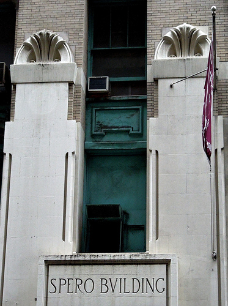

# Pivotal NYC

## Conference room name research

---
# Altman

621 6th Avenue, circa 1877

[more](http://www.nyc-architecture.com/SOH/SOH053.htm)
[more](http://daytoninmanhattan.blogspot.com/2012/12/the-b-altman-store-no-615-629-6th-avenue.html)

---
# Sloane

888 Broadway, circa 1881

[more](http://daytoninmanhattan.blogspot.com/2011/12/w-j-sloane-buildling-880-888-broadway.html)

---
# Constable

115 Fifth Avenue, circa 1876

[more](http://daytoninmanhattan.blogspot.com/2011/12/w-j-sloane-buildling-880-888-broadway.html)

---
# Best & Co.

Sixth Avenue near 23rd, circa 1879

couldn't find a photo

---
# Bergdorf Goodman (5th)

Fifth Avenue and 32nd, circa 1906

couldn't find a photo

---
# Pierrepont (5th)

103 Fifth Avenue (17th), circa 1895

[more](http://daytoninmanhattan.blogspot.com/2011/07/1896-beaux-arts-pierrepont-building-103.html)

---
# Spero

27 West 21st, circa 1908

[more](http://daytoninmanhattan.blogspot.com/2012/11/the-1908-spero-building-nos-19-27-w.html)

---
# Siegel-Cooper (6th)

666 Sixth Venue, circa 1896

[more](http://daytoninmanhattan.blogspot.com/2010/08/big-store-1896-siegel-cooper-department.html)

---
# O'Neill (6th)

Sixth Avenue at 20th, circa 1887

[more](http://daytoninmanhattan.blogspot.com/2010/03/hugh-oneill-dry-goods-building.html)

---
# Scribner

155 Fifth, circa

bookstore

[more](http://www.nyc-architecture.com/MID/MID047.htm)
[more](http://daytoninmanhattan.blogspot.com/2011/04/charles-scribner-co-building-no-597-5th.html)

---
# Sohmer

170 Fifth Avenue, circa 1897

pianos

[more](http://daytoninmanhattan.blogspot.com/2011/06/1898-sohmer-piano-co-building-170-fifth.html)

---
# Stern (23rd Near 6th)

West 23rd, circa 1878

[more](http://daytoninmanhattan.blogspot.com/2011/06/1898-sohmer-piano-co-building-170-fifth.html)

---
# Lord & Taylor (Broadway)

Broadway and 19th, circa 1870

[more](http://daytoninmanhattan.blogspot.com/2010/04/surviving-sliver-of-old-lord-taylor.html)

---
# Macy

Sixth Avenue and 14th Street, circa 1858

[more](http://jason-cochran.com/blog/the-ghosts-of-macys-on-14th-street/)

---
# Wanamaker

Broadway and 10th, circa 1906

"the iron palace"

not really in the neighborhood, though

[more](http://daytoninmanhattan.blogspot.com/2012/11/the-1906-john-wanamaker-annex-no-770.html)

---
# Adams

675 Sixth, circa 1899

[more](http://daytoninmanhattan.blogspot.com/2010/10/1900-adams-co-building-675-sixth-avenue.html)

---
# Ehrich

Sixth Ave at 22th Street, circa 1889

[more](http://daytoninmanhattan.blogspot.com/2011/06/1889-ehrich-brothers-dry-goods-store.html)

---
# Gimbel

???

---
# Saks

???

---
# Limelight

20th St at Sixth Avenue, circa 1846

"english country parish"

[more](http://daytoninmanhattan.blogspot.com/2010/05/church-of-holy-communion.html)

---
# Simpson-Crawford

641 Sixth Ave, circa 1902

[more](http://daytoninmanhattan.blogspot.com/2011/12/exclusive-1902-simpson-crawford-dept.html)

---
# McCreery

Broadway at 11th, circa 1869

not really in the neighborhood

[more](http://daytoninmanhattan.blogspot.com/2011/03/1868-mccreery-co-dry-goods-store-801.html)

---
# Century Club

111 E 15th, circa 1847

[more](http://daytoninmanhattan.blogspot.com/2012/07/century-association-building-no-109-111.html)

---
# Ditson

East 34th, circa 1907

not really in the neighborhood

[more](http://daytoninmanhattan.blogspot.com/2012/05/1907-ditson-building-nos-8-to-12-east.html)

---
# Errico

???

---
# Macintyre

???

---
# Goelet

900 Broadway at 20th, circa 1886

[more](http://daytoninmanhattan.blogspot.com/2012/11/the-1886-goelet-buildling-nos-894-900.html)

---
# Cammeyer

Sixth Ave and 20th St, circa 1892

[more](http://daytoninmanhattan.blogspot.com/2010/09/1892-cammeyer-building.html)

---
# Gorham

Broadway and 19th, circa 1884

[more](http://daytoninmanhattan.blogspot.com/2010/09/1884-gorham-manufacturing-building.html)

---
# Hoyt

Broadway and 18th, circa 1868

[more](http://daytoninmanhattan.blogspot.com/2012/10/the-1868-hoyt-building-nos-873-879.html)

---
# Warren

903 Broadway at 20th, circa 1891

[more](http://daytoninmanhattan.blogspot.com/2013/06/the-1891-warren-building-nos-903-907.html)

---
# Mortimer

935 Broadway at 22nd, circa 1862

civil war period architecture

[more](http://daytoninmanhattan.blogspot.com/2011/06/1862-mortimer-building-935-939-broadway.html)

---
# Parish

???

---
# Hawes

872 Broadway at 18th, circa 1847

smaller

[more](http://daytoninmanhattan.blogspot.com/2013/05/the-hawes-building-no-872-broadway.html)

---
# Stewart

Fifth Avenue at 35th, circa 1914

[more](http://daytoninmanhattan.blogspot.com/2012/12/the-1914-stewart-building-nos-402-404.html)

